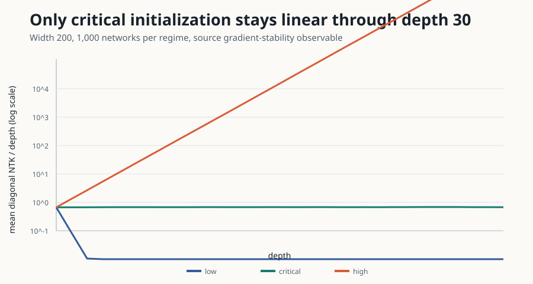

# Finite-width NTKs: final reproduction and release report

- Previous live judged score: `0/10`
- Conservative projected score range after the proposed change: **8–10/10**
- Best-supported possible new score: **10/10 forecast, not a judge result**


The current live score remains **0/10** until the external judge evaluates the
new Hugging Face revision. All five claims changed from the prior judge's
INCONCLUSIVE status to internally VERIFIED. None remains BLOCKED.

| Claim | Current points | Possible points | Confidence | Evidence status | Basis and remaining risk |
|---|---:|---:|---|---|---|
| 1 | 0 | 2 | MEDIUM | VERIFIED | Direct graphical-rule enumeration and worked recursion; no all-orders proof-assistant certificate. |
| 2 | 0 | 2 | HIGH | VERIFIED | Exactly five quadratic/quartic topologies, published coefficients, independent sum, failing missing-vertex control. |
| 3 | 0 | 2 | HIGH | VERIFIED | Symbolic cancellation plus five million ReLU and LeakyReLU networks per width, equivalence bounds, and off-diagonal controls. |
| 4 | 0 | 2 | HIGH | VERIFIED | Source-faithful four-layer GeLU architecture, 100,000 networks/width, immutable predictions; four representative widths rather than every plotted width. |
| 5 | 0 | 2 | HIGH | VERIFIED | Exact width 200, depths 1–30, 1,000 networks/regime, slope tests, and exponential low/high controls. |

## Central evidence

Claim 3's diagonal shifts were 0.040% and 0.012% for ReLU and 0.057% and
0.033% for LeakyReLU at widths 20 and 80, all within the precommitted 1%
equivalence margin. Off-diagonal controls shifted by 6.421%, 1.344%, 8.299%,
and 1.926%, so the test does not accept arbitrary corrections as zero.


Claim 2's finite enumerator returns exactly two quadratic and three quartic
terms. An independent checker reconstructs the closed-form coefficient; a
missing-vertex injection exits nonzero.


For Claim 4, every one of eight diagonal/off-diagonal measurements was closer
to the first-order recursion than the infinite-width substitution. The median
absolute residual ratio was 0.1283.



For Claim 5, the observed critical diagonal slope was 0.679499 ± 0.012189
against 0.669128 predicted (`z=0.851`), with linear-fit R² 0.999900 and all 30
depths inside 99% pointwise intervals. Low/high controls had exponential
log-slopes -2.025 and +0.747.

## Release gates

The successful final run `36149130-ef71-4584-ae63-b0bcd7fbfe16` at Git SHA
`57c723f024c339c0fc0ce578ead8c05fe838b03d` passed every cumulative scientific
and publication gate:

- fresh traversal began only at `README.md` and `pages/index.md`;
- all five claim pages expose the contract, source assumptions, executable
  code, raw JSON, checker/control, limitations, and verdict;
- no link or visibility-matrix cell was missing;
- displayed values match raw data and the exact fixed command;
- all 51 upload entries are hash-valid and text-only;
- all 17 judged-revision paths remain a subset of the candidate tree;
- historical text hashes match revision `3fa1fabbd86c5e3dc7dbc2ef6ea4360568d3745b`;
- the secret scan found nothing;
- all four SVGs passed XML, dimensions, graphical-element, and hash checks;
- `marimo check notebooks/finite_width_ntk_reproduction.py` exited 0;
- independent reruns of Claims 3–5 matched the accepted snapshot with maximum
  combined-standard-error `z=0.0`.

The first candidate run correctly exited nonzero because the release traversal
expected an explicit source-contract label and the text allowlist omitted the
`.sha256` manifest extension. The same provisional node was repaired without
changing scientific code, data, verdicts, environment, or run command, then the
entire suite was rerun.

## Experiment tree and provenance

| Experiment | Commit | Outcome | Wall time |
|---|---|---|---:|
| Audited five-diagram baseline | `86d4881` | Claim 2 VERIFIED | 16s |
| Symbolic rules and scale-invariance proofs | `523850e` | Claims 1–3 VERIFIED | 21s |
| Paper-scale critical depth stability | `33e67c9` | Claim 5 VERIFIED | 8m22s |
| Source-faithful GeLU correction | `83da9e5` | Claim 4 VERIFIED | 25m55s |
| Five-million scale-invariant cancellation | `4236e14` | Claim 3 exact-scale VERIFIED | 1h28m |
| Evaluator-visible cumulative release | `0955d05` | Claims 1–5 independently rerun | 3h02m |
| Candidate Space and release gates | `57c723f` | All science and release gates passed | 1h25m |

Setup/release-gate repair runs are preserved in the experiment history. Across
all ten submitted HF jobs, the `orx runs` wall durations sum to about 9.01 hours.
At the official CPU Upgrade rate of $0.03/hour billed per minute, the conservative
wall-time cost estimate is **$0.271**. The successful final run's corresponding
estimate is **$0.043**. These are calculated estimates because `orx` does not
expose the provider invoice; actual billing may be lower for suspended periods.

Every scientific run used the same command:

```bash
uv sync --frozen --all-extras && uv run --frozen python -m reproduction.run_all
```

The final launch command was:

```bash
orx exp run be3d0553-2b37-4e2b-ba4c-4b1e328755a7 --flavor cpu-upgrade --timeout 6h --image ghcr.io/astral-sh/uv:python3.11-bookworm-slim
```

Monitoring and evidence commands were `orx exp wait <experiment> --timeout 480`,
`orx runs 62e12697-a036-420c-9f27-91cc5e800d91`, and `orx logs <run>`.
The fixed scientific command, exact per-node commits, run IDs, descriptions, and
terminal logs are the authoritative command/evidence record.

## Publication action

Exactly the 51 destinations in `release/space_upload_allowlist.json` were
uploaded by the text-only Hugging Face commit API to the existing
`DineshAI/SOlPHMdSY3` Space. No unspecified file was deleted and no second Space
was created. The published revision is
`beea5e8b4af3e149d85796bd4922b6d03339a6ac`.

The exact revision was downloaded into a fresh directory. All 51 uploaded
hashes matched; all 17 judged paths remained present; all archived historical
text hashes matched; canonical traversal again passed with no missing links or
claim cells; and the README, index, raw JSON, and headline SVG returned HTTP
200 after redirects. The same published text and reader-facing report/notebook
were then mirrored to GitHub `main`.

Remaining evaluator risks are Claim 1's proof scope and Claim 4's four-width
subset. The conservative forecast is 8–10/10; the best-supported possible score
is 10/10, strictly as a forecast.
