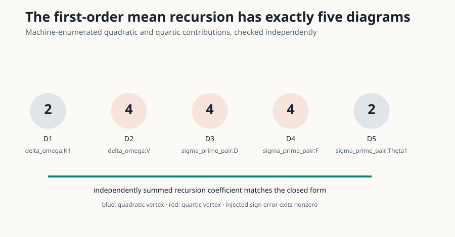

# Claim 2 — VERIFIED

## Exact source contract

Under the Section 4 rules, **all** order-`1/n` diagrams compatible with two
external NTK lines in the Section 5.1 mean recursion are exactly five. They contain
quadratic `Theta1` and `K1` vertices and quartic `V`, `D`, and `F` vertices.
Appendix E coefficients are respectively `1`, `1/2`, `1/8`, `C_W/2`, and `C_W`
with the common width factor outside the tensor recursion. Anchors: `S5.SS1`,
`S5.E12`, `firstcorrectionntk`.

## Executable evidence

[Enumerator](../code/diagram_rules.py) and [verifier](../code/claim2_verifier.py)
returned five unique IDs:

| Diagram | Vertex class | Coefficient |
|---|---|---|
| `delta_omega:K1` | quadratic | `1/2` |
| `delta_omega:V` | quartic | `1/8` |
| `sigma_prime_pair:D` | quartic | `1/2` (times `C_W`) |
| `sigma_prime_pair:F` | quartic | `1` (times `C_W`) |
| `sigma_prime_pair:Theta1` | quadratic | `1` |

The [independent checker](../code/claim2_independent_checker.py) reconstructs the
closed algebraic sum separately. The [negative control](../code/claim2_negative_control.py)
deletes a required vertex and exits nonzero. Both passed their intended contracts.
Full certificate: [raw JSON](../data/cumulative_run.json).

## Limits

The certificate verifies the published topology enumeration and coefficients. It
does not replace formal peer review of every intermediate tensor-index derivation.
