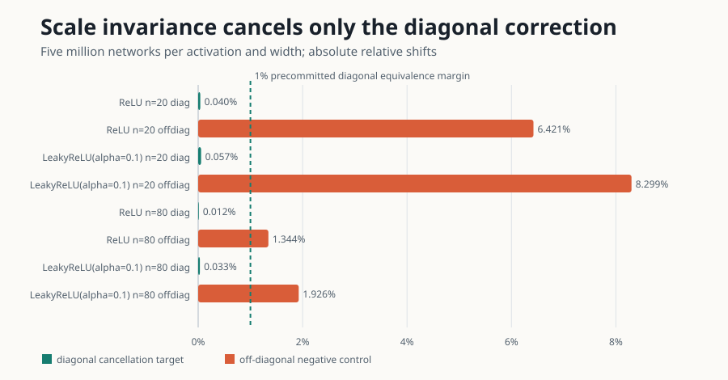

# Claim 3 — VERIFIED

## Exact source contract and assumptions

Theorem 5: for a bias-free iid-Gaussian MLP in NTK parametrization and a
positive-homogeneous activation (`sigma(lambda z)=lambda sigma(z)` for `lambda>0`),
the **ensemble-mean diagonal** NTK has no finite-width corrections. Appendix G
extends the first-order cancellation to every order in `1/n`. ReLU and LeakyReLU
are named examples. This does not claim that finite Monte Carlo error is zero or
that off-diagonal corrections vanish.

Source anchors: Section 5.3/Theorem 5 and Appendix G. Source archive SHA-256
`5237b9fec2f128b23266771acbc8e44837619d5309cd32840ce537071b64c47f`.

## Symbolic and paper-scale evidence

[Symbolic verifier](../code/claim3_verifier.py) reconstructs the homogeneity
identities and the cancellation; its independent checker and sign-injection
control pass. The direct [paper-scale experiment](../code/claim3_paper_scale.py)
uses the exact bias-free four-layer/two-output architecture, `C_W=2`, source
inputs, two Hutchinson probes, 100 raw block means, and **5,000,000 independent
initializations at each width**. Seed root is `325081522`; widths are 20 and 80;
LeakyReLU uses `alpha=0.1`.

| Activation, width | Diagonal mean ± SE | Infinite mean | z | 99% relative upper bound | Off-diagonal relative shift (control) |
|---|---:|---:|---:|---:|---:|
| ReLU, 20 | 2.677574 ± 0.001376 | 2.676510 | 0.773 | 0.1722% | 6.421% (`z=48.49`) |
| LeakyReLU, 20 | 2.759170 ± 0.001405 | 2.757611 | 1.110 | 0.1878% | 8.299% (`z=43.62`) |
| ReLU, 80 | 2.676830 ± 0.000987 | 2.676510 | 0.324 | 0.1070% | 1.344% (`z=10.98`) |
| LeakyReLU, 80 | 2.756708 ± 0.001013 | 2.757611 | 0.891 | 0.1274% | 1.926% (`z=10.78`) |

Every diagonal is inside the precommitted 1% equivalence margin and within 4 SE.
Every off-diagonal control detects at least a 1% correction at 5 SE. The
[independent exact-Jacobian checker](../code/claim3_empirical_independent_checker.py)
agrees; the [2% injected-correction control](../code/claim3_empirical_negative_control.py)
exits nonzero. Download all 100 block means in the [raw JSON](../data/cumulative_run.json).

## Limits

Finite sampling corroborates, but cannot prove, a universal all-width theorem by
itself. The verdict therefore combines the independently reconstructed symbolic
cancellation with the source-scale experiment and assumption-sensitive controls.
