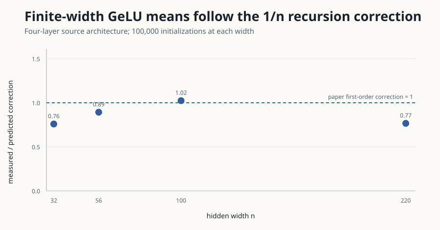

# Claim 4 — VERIFIED

## Source clarification and exact source contract

The imported judge wording conflated two v4 experiments. The actual Section 6
Figure 2 uses a four-layer **GeLU** MLP, `C_W=1.98305826`, 100,000 samples per
width, and compares measured means with the solved first-order recursion. Figure 3
is the separate five-million-sample ReLU diagonal experiment covered by Claim 3.
This verifier tests the actual Figure 2 claim at widths 32, 56, 100, and 220
(all above 20).

The immutable source-PDF curves were not fit to reproduction samples. Their
SHA-256 values are `865845aaa9c0f203e9fc041c7d5841c1548bc5d511abe55a8c9f9eef782683d6`
(diagonal) and `6623a42cf5703a8374603e190beef9f6e267a9a1dd3f13a536ec94e7ba0fceb5`
(off-diagonal).

## Results

[Verifier](../code/claim4_gelu.py) used 100 raw block means and two probes per
network. Values below show diagonal components; every one of all eight diagonal
and off-diagonal points was closer to the first-order prediction than to the
infinite-width substitution.

| Width | Measured ± SE | Infinite prediction | First-order prediction |
|---:|---:|---:|---:|
| 32 | 1.782813 ± 0.004080 | 1.749264 | 1.793464 |
| 56 | 1.771809 ± 0.002985 | 1.749264 | 1.774521 |
| 100 | 1.763749 ± 0.002203 | 1.749264 | 1.763408 |
| 220 | 1.754189 ± 0.001460 | 1.749264 | 1.755693 |

The median absolute residual ratio (first-order/infinite) was 0.1283. The
[independent checker](../code/claim4_independent_checker.py) re-extracts the source
curve. Replacing the correction with the infinite-width curve is the negative
control and fails. Seeds, off-diagonal values, 100 block means, and runtimes are
in the [raw JSON](../data/cumulative_run.json).

## Limits

The paper used additional plotted widths. This faithful reproduction samples four
representative source widths with 100,000 fresh networks each; it does not claim
to duplicate every plotted marker.
